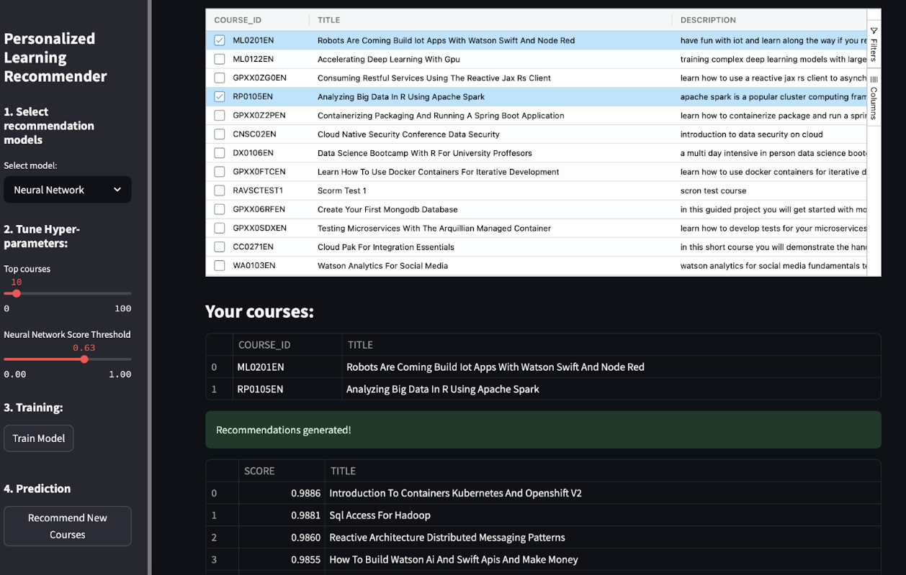

# Streamlit Course Recommendation App

A machine learning-powered web app built with Streamlit to recommend educational courses based on user preferences and course content. This app showcases my expertise in Python, Streamlit, and data science through seven specialized models.

## Video Demo
[Video Demo of app here!](https://www.dropbox.com/scl/fi/39yjvo7q2u56pabkuc6tj/courserecommenderapp.mp4?rlkey=5eklk4331rvf7iyz1zay37jhe&st=k5rx6cq8&dl=0)

## Capstone Slide Presentation
[Capstone Slide Presentation here!](https://github.com/Jenkins1128/CourseRecommenderApp/blob/main/Capstone%20Presentation.pdf)

## Features
- **Course Similarity Utilizing Course Similarity Matrix**: Recommends courses using cosine similarity on bag of word document matrix.
- **User Profile**: Builds personalized profiles from user interests and course history.
- **Clustering Using K-means**: Groups courses into categories for discovery.
- **Clustering with PCA**: Enhances clustering with PCA for better separation.
- **KNN**: Suggests courses via K-nearest neighbors.
- **NMF**: Extracts latent topics for thematic recommendations.
- **Neural Network**: Predicts course relevance with a TensorFlow model.

## Screenshots



## Setup Instructions
To run locally:
1. Clone the repository:
   ```bash
   git clone <your-repo-url>
   cd <repo-name>
   ```
2. Install dependencies:
   ```bash
   pip install -r requirements.txt
   ```
3. Run the app:
   ```bash
   streamlit run app.py
   ```
4. Open `http://localhost:8501` in your browser.

## Requirements
Key dependencies (see `requirements.txt`):
- `pandas==1.5.3`
- `numpy==1.26.4`
- `tensorflow==2.19.0`
- `scikit-learn==1.4.2`
- `scikit-surprise==1.1.4`
- `streamlit==1.44.1`
- `streamlit-aggrid==0.2.2-2`

## Technical Notes
- Optimized for local execution due to memory-intensive models (requires ~8 GB RAM).
- Used `@st.cache_resource` to manage resources.
- Free and basic cloud platforms were insufficient for RAM needed, so I provide a video and local setup instructions.
- Models are cached for performance; datasets are accessed via URLs to keep the repo lightweight.

## License
MIT License

## Contact
[Isaiah Jenkins] – [LinkedIn](linkedin.com/in/isaiah-jenkins)
